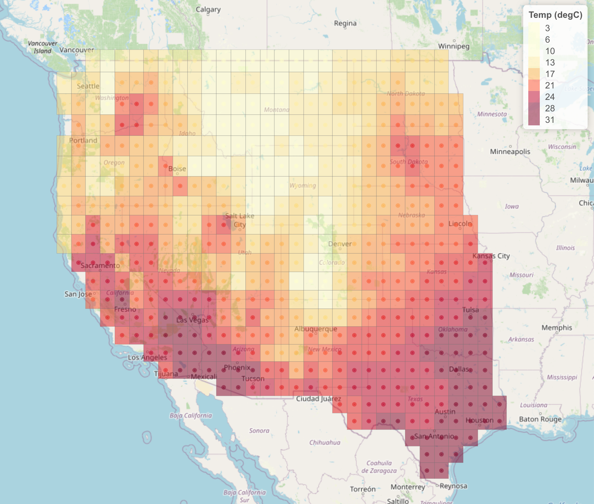
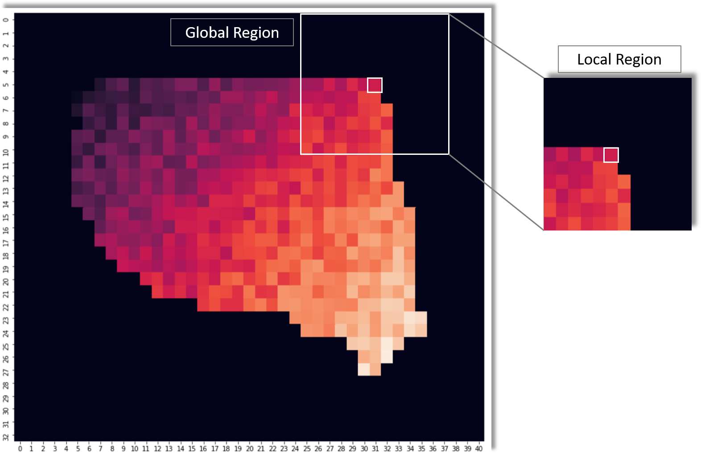
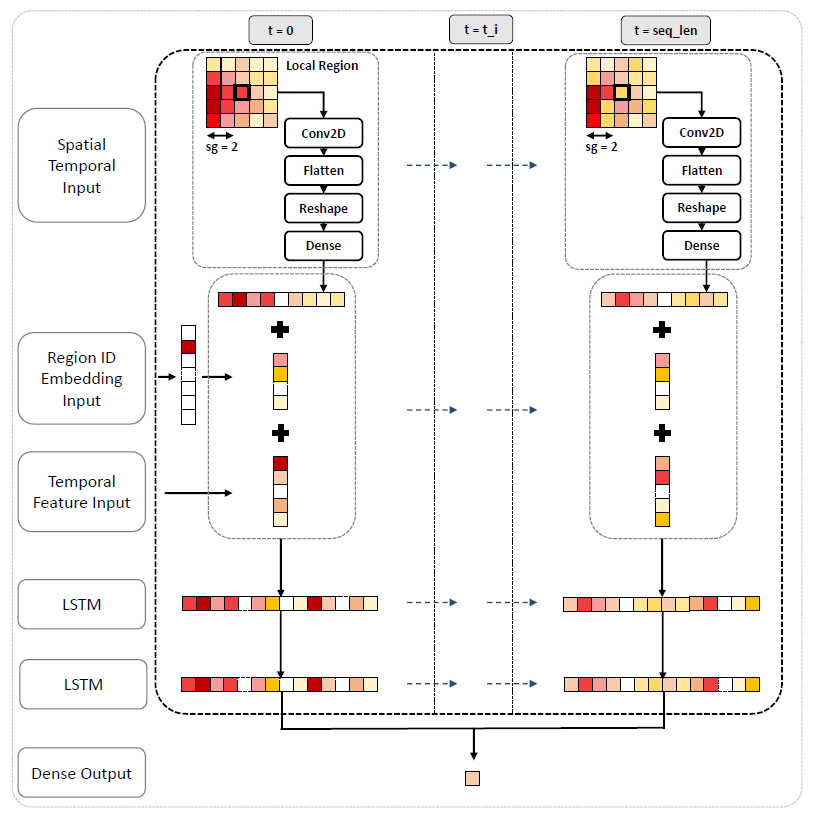

# Subseasonal Rodeo

### **Predicting subseasonal temperature & precipitation 3-4 and 5-6 weeks ahead for Western USA across 514 geographical regions**

### Introduction

Water and fire managers in Western USA rely on subseasonal (2-6 weeks ahead) forecasts to allocate water resources, manage wildfires, and prepare for droughts and other weather extremes [1]. Physical PDE based models typically dominate shorter term weather forecasts, however these become more chaotic in nature for subseasonal time frames. The abundant availability of meterological records (https://www.noaa.gov/) and computational resources allows for statistical and machine learning approaches to be employed to improve the skill of the longer term forecasts. In colaboration with the US Government and leading US Universities, Topcoder hosted a competitive challenge running through 2020 (Subseasonal Rodeo) to incentivize community engagement and stimulate development in this important area.

This repo outlines a hybrid spatial-temporal deep learning approach to the subseasonal forecasting task.

### Purpose

The objective of this modelling effort is to forecast 2 week average temperature, and 2 week total precipitation for 3-4 and 5-6 weeks forecast horizons - subseasonal forecasts - across 514 regional geographies in Western USA. This resuts in four modelling challenges - 

- temp34
- temp56
- prec34
- prec56

The geographical regions lie in the Western contiguous USA (not including Hawaii & Alaska), bounded by latitudes 25N to 50N and longitudes 125W to 93W, at a 1° by 1° resolution. A sample prediction across these geographical regions is shown below. The scoring metric is RMSE averaged across all 514 regions, for a given forecast horizon.

#### USA Regional Temperature Plot

#### Data

Data is sourced from NOAA - the National Oceanic and Atmospheric Administration - with data available for all geographical regions from 1979 to 2020. These data sources are updated daily, as such forecasts can be made 3-4 and 5-6 weeks ahead with minimal data lag. Where available at a different lat lon resolution, the data is interpolated to a 1° by 1° resolution to fit the target prediction grid.

The following data sources are used in this study as meterological input features - 

- Temperature - target and feature variable
- Precipitation - target and feature variable
- Relative humidity at surface (rhum) - feature variable
- Geopotential height (hgt10) - feature variable
- Potential evaporation rate (pevpr) - feature variable
- Precipitable water (pr_wtr) - feature variable
- Pressure (pres) - feature variable
- Sea level pressure (slp) - feature variable

Target variables are sourced using subseasonal_forecasting/download/(get_gt.py, get_target_data.py); feature variables are sourced using subseasonal_forecasting/download/get_feature_data_(2019, 2020).sh.

### Spatial Temporal Modelling Approach

#### Preprocessing

All datasets were downloaded, interpolated to 1° by 1° resolution for the 514 required geographies, converted to 2 week averages (or totals) and merged on unique start date and region lat lon.

Cyclic features for date fields are added - with cosine and sin components taken for month of year and day of year.

A unique region_id string was added to represent each region, resulting in a 514 class categorical feature.

All 8 continuous weather features were standardized by subtracting mean and dividing by std of training dataset, before being scaled to [0,1] using a MinMaxScaler.

#### Local Region Representation

The full dataset was transformed to a global region tensor, with geographical regions not considered for prediction zero padded for each feature. Additionally, further zero padding was applied up to a max spatial granularity (max_sg, here set as 5) around the fringe regions. This resulted in a tensor of shape [num_timesteps, global_padded_width, global_padded_height, num features].

This modelling approach captures local spatial information by inputing local region tensors, centred around each region, with spatial granularity sg < max_sg (here we use sg = 5, as shown in below figure). Note only weather features are fed through this layer.

#### Global Region Tensor Diagram

#### Sequencing

A sequence length of 26 was used for this model, with step 7 - half a year of 26 fortnightly 2-week averaged inputs. Other sequence lengths and steps were considered, and can be parametrised; however this choice had the most success.

#### Model

The hybrid spatial-temporal model takes three input streams for a given region_id and start date. These three input streams are processed and concatenated before being fed into the LSTM architecture. See below diagram for architecture.

1. Spatial Temporal Input - at each timestep, local region tensors centred around region_id are fed through a 2D convolutional layer, before being flattened, and fed through a dense layer.

2. Region ID Embedding Input - at each timestep, region_id categorical field is fed through an embedding layer, with the aim to numerically compute similarity between regions.

3. Temporal Input - at each timestep, weather and cyclical date features are input.

The outputs of these three layers are concatenated into a single feature layer, which is fed into the LSTM architecture. This passes through two LSTM layers, followed by a single dense output layer predicting the target variable.

#### Spatial Temporal Model Diagram

#### Training

Training was run on Google Colab to utilise GPU support. To navigate RAM constraints, a generator was used for the local region processing to feed batches of 256 inputs into the model on each iteration, with the global region tensor stored in memory for faster processing upon fetch. Training was run for 50 epochs, with 500 steps per epoch, mean absolute error loss, and Adam optimizer with standard parameters. The latest 2 years of data was initially kept aside for validation and test. The model was built in Tensorflow 2, with Tensorboard used for diagnostic purposes and model comparison.

Hyperparameter and architecture tuning was conducted on sequence length, step (days between input timesteps), embedding size (including no embedding), spatial granularity, presence of 1D convolutional layers prior to LSTM input (to reduce dimensionality of longer sequences), dense layer unit size, number of 2D convolutional layers, and LSTM parameters.

The following parameters were used:
###### *SEQ_LEN = 26, STEP = 7, SG = 5, BATCH_SIZE = 256, STEPS_PER_EPOCH = 500, BUFFER_SIZE = 15000, PREFETCH_SIZE = 5, EPOCHS = 50, CONV2D_LAYERS = 1, CONV1D_LAYERS = 0, LSTM_LAYERS = 2, RGN_ID_EMB_DIM = 8, SPTL_CONV_FILTERS = 16, SPTL_KERNEL_SIZE = 2, SPTL_STRIDE = 1, SPTL_PADDING = 'same', SPTL_OUTPUT_DIM = 24, LSTM1_UNITS = 64, LSTM2_UNITS = 64, DROPOUT_RATE = 0.3*

###### [1] *Improving Subseasonal Forecasting in the Western U.S. with Machine Learning - https://arxiv.org/pdf/1809.07394.pdf*
